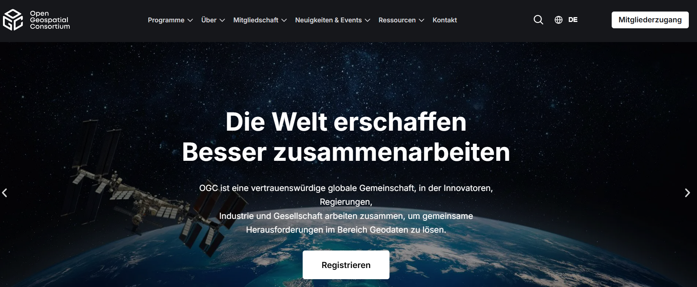

OGC-Dienste: WMS- und WFS-Dienste
=======================

Open Geospatial Consortium (OGC)
   - Internationale Organisation, die Standards für Geodaten und Geodatendienste entwickelt
   - OGC-Standards ermöglichen den Zugriff auf Geodaten über das Internet
   - Ziel: Interoperabilität von Geodaten und Geodatendiensten sicherstellen

OGC-Standards: Die Grundlage für Interoperabilität. Sie erleichtern den Austausch und die Nutzung von Geodaten weltweit.

Technischer Hintergrund:

- `OneGeology presentation: <https://www.slideserve.com/zamir/technical-information-ogc-wms-wfs-csw>`_

Kartendienste (WMS):
---------

Web-Map-Service (WMS)
   - Zugriff auf Rasterdaten/-kacheln
   - Daten können nicht direkt in QGIS bearbeitet werden
   - Daten dienen visuellen Zwecken

.. admonition:: Einbinden von Geodatendiensten (WMS) in QGIS
    :class: admonition-youtube

    ..  youtube:: 8-ywBmmt2G0

    `Landesamt für Geoinformation u. Landentwicklung BW <https://www.youtube.com/watch?v=8-ywBmmt2G0>`_

Geodatendienste:
--------

Web-Features-Service (WFS)
   - Zugriff auf Vektordaten
   - Daten können direkt in QGIS bearbeitet werden
   - Daten können direkt in QGIS gespeichert werden

.. admonition:: Einbinden von Geodatendiensten (WFS) in QGIS
    :class: admonition-youtube

    ..  youtube:: Y9CHJpi3ITI&t

    `Landesamt für Geoinformation u. Landentwicklung BW <https://www.youtube.com/watch?v=Y9CHJpi3ITI&t>`_

Video-Tutorial:
--------

.. admonition:: WMS und Vektorkacheln in QGIS nutzen
    :class: admonition-youtube

    ..  youtube:: qdLznmrrMw0&t

    `Geodatenwelten <https://youtu.be/qdLznmrrMw0?si=drgA_lFOKLDWg4QW>`_

